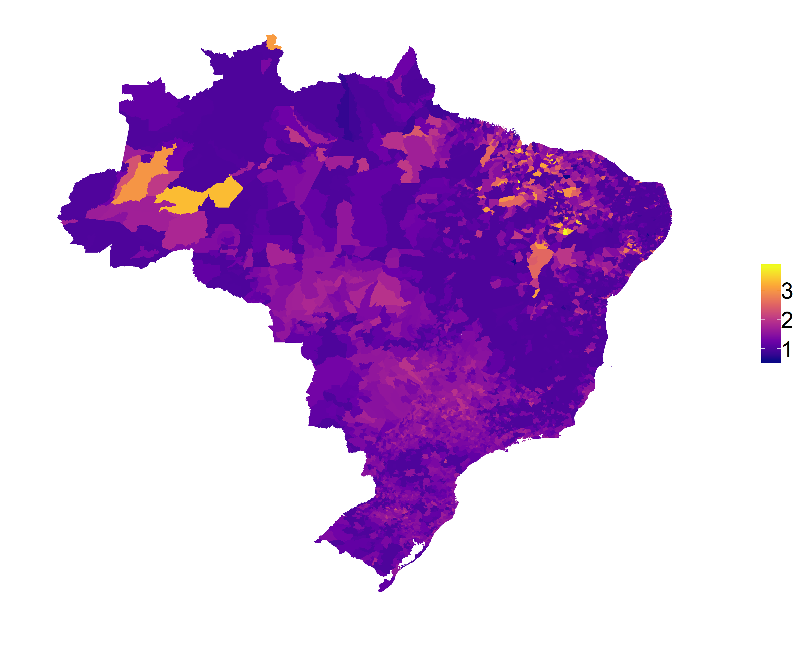

# Desigualdade de Gênero

Um dos Objetivos de Desenvolvimento Sustentável estabelecidos pela Organização das Nações Unidas é garantir a igualdade de gênero e empoderar todas a mulheres e meninas. 

Este momento ainda não foi alcançado, principalmente em países como o Brasil. Assim, este projeto consiste em uma análise sobre a desigualdade de gênero nos municípios do Brasil, considerando os dados do Censo Demográfico de 2010. 

Aqui vamos compreender a atual situação da desigualdade de gênero nos municípios brasileiros e identificar as principais características sociais e econômicas de cada grupo de municípios de acordo com o seu nível de desigualdade.

## Dados

Foram utilizados dados sociodemográficos e socioeconômicos dos municípios do Brasil da base do Censo de 2010. Estes dados podem ser encontrados no site oficial do IBGE, no baco de dados [SIDRA](https://sidra.ibge.gov.br/pesquisa/censo-demografico/demografico-2010/inicial).

## Variáveis

Foram selecionadas variáveis relacionadas com o gênero considerando dados usados para o cáclculo de Índices Globais de Gênero elaborados por organizações como FEM, OCDE e ONU.

## Análises Preliminares

1. Aproximadamente 50,4% da população
brasileira é do sexo masculino
2. Para cada domicílio sob responsabilidade 
de mulheres, há 2 sob responsabilidade
de homens
3. Em quase 63% dos municípios, a renda 
recebida pela população masculina é 
superior a da população feminina
4. O analfabetismo em pessoas acima de 
15 anos possui equilíbrio médio com 
relação ao sexo, entretanto o cenário
é mais favorável para mulheres
5. Em 75% dos municípios, os homens 
recebem cerca de 43% a mais do 
que as mulheres
6. Apenas 1,2% dos municípios possui a
maioria de seus domicílios com 
mulheres responsáveis

## Razão de Sexo

No mapa do Brasil é possível ver que praticamente em todo o país os domicílios são de responsabilidade dos homens, com um um agravante em alguns municípios do Centro-Oeste e Norte.

###### Razão de sexo entre responsáveis pelo domicílio

Vê-se ainda que em muitos municípios das regiões Norte e Nordeste do país há uma enorme disparidade entre os salários recebidos.

###### Razão de sexo considerando a renda média mensal

Porém, existe certa igualdade na educação recebida por homens e mulheres no país.

###### Razão de sexo segundo o nível educacional

## Análise de Cluster

Para identificação de grupos de municípios de acordo com o nível de desigualdade de gênero, foi aplicada a técnica de clusterização K-means.
Como esperado, em grande parte do país ainda existe o cenário de desigualdade entre gêneros.

###### Grupos de municípios de acordo com nível de desigualdade de gênero

## Índice de Desigualdade de Gênero

Este índice foi elaborado através da técnica de Análise de Componentes Principais e visa compreender os municípios com os aspectos mais preocupantes frente a este cenário de desigualde.

